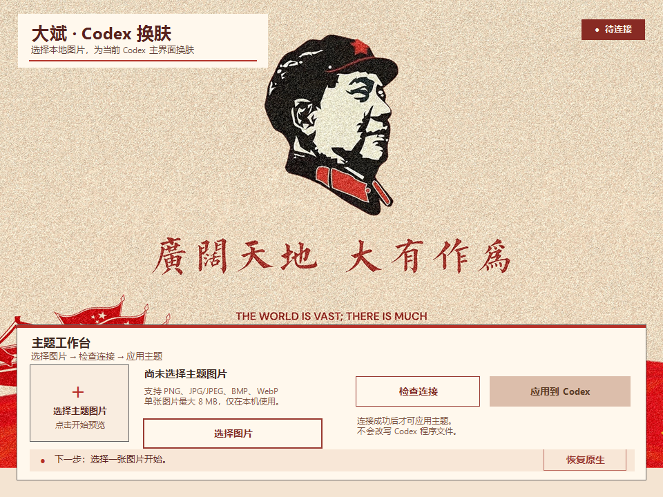

# Codex 一键换肤 · 大斌

Windows x64 Codex Desktop 的本地图片换肤 Skill。选择本机图片后，它通过已开启的本机 CDP 回环接口将样式注入当前 Codex 页面；不会改写 Codex 程序文件、`app.asar`、登录状态或账户配置。

## 界面预览



启动器采用海报背景、宣纸色工作台、朱红主操作和深墨文字。图片选好后，按界面提示依次完成连接检查和应用。

## 使用方式

1. 打开 Codex Desktop，并进入能看到侧栏和输入框的主界面。
2. 双击 `scripts/StartDabinSkin.bat`。
3. 点击“选择图片”，选中本机主题图并确认预览。
4. 点击“检查连接”；状态从“待连接”变为“已连接”后，“应用到 Codex”才会启用。
5. 点击“应用到 Codex”，成功后状态显示“已应用”。需要移除效果时，点击“恢复原生”。

支持 PNG、JPG/JPEG、BMP、WebP，单张图片最大 8 MB。用户消息会采用深色背景与白色文字，保证在图片主题下仍可阅读。

## 安装与启动

无需放进固定路径。下载或解压完整文件夹到任意本地位置后，直接双击：

```text
scripts/StartDabinSkin.bat
```

如需在 Codex 对话中调用，请在新对话中使用 `$skill-installer`，并提供仓库地址 `https://github.com/yongbinlan/dabin-one-click-skin-codex` 安装此 Skill；安装完成后重新开启一轮对话，再输入：

```text
使用大斌一键换肤，将这张图片应用到 Codex。
```

命令行用法、状态核验和故障排查见 [使用教程](docs/使用教程.md)。

## 桌面快捷方式图标（可选）

完整包附带 `assets/dabin-codex-skin-icon.ico`。若 Windows 为 `StartDabinSkin.bat` 显示通用批处理图标，可先为它创建快捷方式，再在“属性 → 快捷方式 → 更改图标”中选择该 `.ico` 文件。图标与启动器使用相同的深墨、朱红和宣纸白配色；不会影响启动参数或换肤行为。

## 技术边界

- 仅适用于 Windows x64、Node.js 22+、已运行的 Codex Desktop。
- 仅连接 `127.0.0.1:9341` 的本机调试接口。
- 图片和运行状态仅保存在 `runtime/`，已被 Git 忽略。
- “恢复原生”会移除本次注入并停止本地守护控制器。

## 许可与图片

本仓库的换肤控制器、启动器界面、Skill 文档和样式均为本项目自行实现，采用 [MIT License](LICENSE)。主题图片及默认启动背景请仅在已获得相应授权的范围内使用和再分发；图片素材说明见 [assets/README.md](assets/README.md)。
